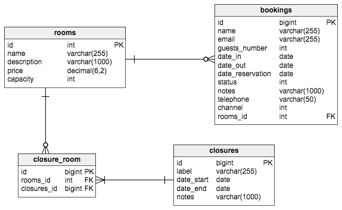

# passerelle-python
Another REST API for La Passerelle des Corton

# Introduction

A REST API to manage bookings for La Passerelle.

* Backend : Python 3.5 / Django 1.9 / SQLite3 
 
*Database schema :* 

# Running The Application

To run the application run the following commands in passerelle-python.

* To setup the h2 database run.

		python3 server/manage.py makemigrations passerelle
		python3 server/manage.py migrate

* To run the server run.

        python3 server/manage.py runserver

# Test the API

When the server is running, the API is available here : http://0.0.0.0:8000.
Use the following urls when testing the API.

passerelle.models Room

      GET     http://0.0.0.0:8000/rooms 
      GET     http://0.0.0.0:8000/rooms/{id} 
      POST    http://0.0.0.0:8000/rooms/ 
      PUT     http://0.0.0.0:8000/rooms/{id}/ 
      DELETE  http://0.0.0.0:8000/rooms/{id}
      
passerelle.models Booking      

      GET     http://0.0.0.0:8000/bookings 
      GET     http://0.0.0.0:8000/bookings/{id} 
      POST    http://0.0.0.0:8000/bookings/ 
      PUT     http://0.0.0.0:8000/bookings/{id}/ 
      DELETE  http://0.0.0.0:8000/bookings/{id} 

passerelle.models Closure
      
      GET     http://0.0.0.0:8000/closures 
      GET     http://0.0.0.0:8000/closures/{id} 
      POST    http://0.0.0.0:8000/closures/ 
      PUT     http://0.0.0.0:8000/closures/{id}/ 
      DELETE  http://0.0.0.0:8000/closures/{id} 

